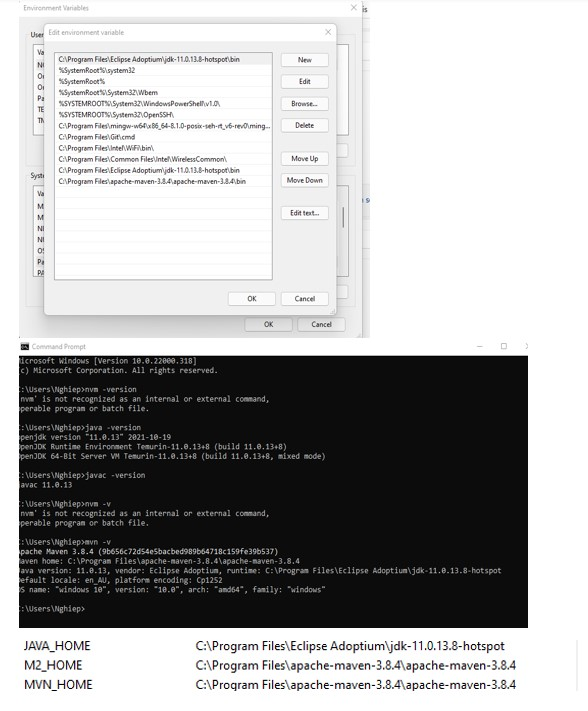
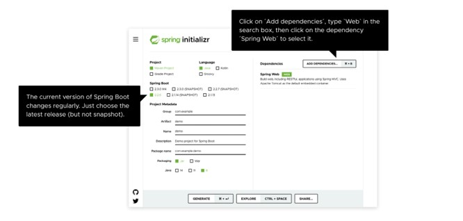
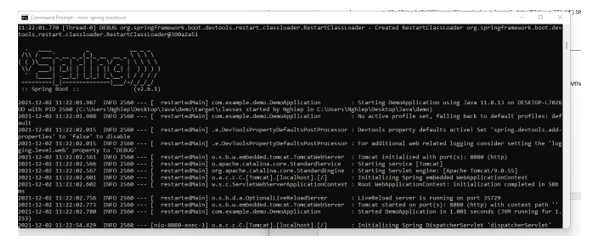
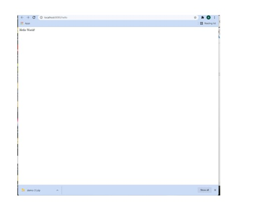

#### Tổng quan  
SpringBoot  là một phần trong Spring framework sử dụng ngôn ngữ JAVA. Nó giúp đơn giản hóa quá trình lập trình một ứng dụng (website) với Spring , chỉ cần tập trung phát triển tính năng của ứng dụng.   

#### Mục đích   
Tải SpringBoot , sử dụng code editor là visual studio code  và chạy demo code trên command prompt để cho ra kết quả “HELLO” qua link   **_http://localhost:8080/hello_**

#### Các  Bước:
**Bước 1 :**
Đầu tiên , tải AdoptOpen JDK version 11 về máy. Sau đó , add path và tạo Java_Home ở phần system variable. Sau đó , kiểm tra kết quả tải bằng cách vô command prompt và nhập java -version và javac -version. Tiếp theo , tải apache marven về máy. Sau đó , add path và tạo NVM_Home ở phần system variable. Sau đó , kiểm tra kết quả tải bằng cách vô command prompt và nhập nvm -version. Cuối cùng , tiếp tục sử dụng command prompt và nhập nvm install để sư dụng nvm trên command prompt .

**Bước 2:**
Tải Visual Studio package . Nếu có visual code rồi thì tải recommend extensive pack for java. Bao gồm : 
1/ Language Support For Java by Red Hat 
2/ Debugger for Java 
3/ Test Runner for Java 
4/ Maven for Java 
5/ Project Manager for Java 
6/ Viusual Studio IntelliCode

**Bước 3:**
Tải Spring Boot theo phiên bản sau : 

Sau khi tải , giải nén file rồi lưu vào file trên máy tính

**Bước 4:**
Tìm file DemoApplication.java ở trong ***src/ main/com/example/demo***. Sau đó, copy và Paste code này vào : 

'''

package com.example.demo;
import org.springframework.boot.SpringApplication;
import org.springframework.boot.autoconfigure.SpringBootApplication;
import org.springframework.web.bind.annotation.GetMapping;
import org.springframework.web.bind.annotation.RequestParam;
import org.springframework.web.bind.annotation.RestController;
             
@SpringBootApplication
@RestController
public class DemoApplication {

        public static void main(String[] args) {
        SpringApplication.run(DemoApplication.class, args);
        }
                  
        @GetMapping("/hello")
        public String hello(@RequestParam(value = "name", defaultValue = "World") String name) {
        return String.format("Hello %s!", name);
        }
                
}

'''

**Bước 5 :**
Mở terminal lên và cd vô folder đã lưu file demo. Sau đó , nhập mvnw spring-boot:run. Nếu hiện như dưới đây là đúng: 

Cuối cùng , mở website lên và nhập ***http://localhost:8080/hello***  . Check nếu website ra giống như vậy là đúng 